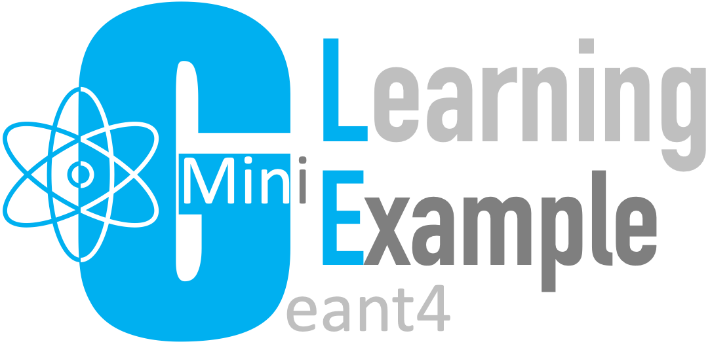

[](https://www.youtube.com/playlist?list=PLw3G-vTgPrdCkTdisAL5UdUPazZdjqlpm)
[](https://space.bilibili.com/610308328)
[](https://shimo.im/docs/HJv6Qrvpx9R9wHqP)
[](#tags)


`MinGLE`, a Mini [Geant4][] Learning Example, uses minimal C++ coding to demonstrate the usage of essential [Geant4][] components step by step. It is not tied to any specific experiment or third party library, which makes it a clean starting point of writing your own [Geant4][] applications.

## Prerequisites
- [Geant4][] 10.7 or above is needed to use
  - [G4RunManagerFactory][]
- [CMake](https://cmake.org/download/) 2.9 or above is needed to compile [mingle.cc](mingle.cc) across multiple operating systems
- A not-so-old C++ compiler, e.g.
  - [Visual studio 2019](https://visualstudio.microsoft.com/downloads/) for Windows
  - [GCC](https://gcc.gnu.org/) (4.9 or above) for Linux
  - [clang](https://clang.llvm.org/) for MacOS installed by running `xcode-select --install` in a terminal

## Getting started
[](https://youtu.be/6xqCtS38SXQ)

If you know how to use [Git][], please follow the instruction below. If you don't, please download a specific version of `MinGLE` from [here](https://github.com/jintonic/mingle/tags).

```sh
# download mingle git repository from github to a local hard disk
$ git clone https://github.com/jintonic/mingle.git
# get into the mingle directory
$ cd mingle
# create a subdirectory called 'build'
$ mkdir build
# get into the build directory
$ cd build
# run cmake text-based user interface (TUI)
$ ccmake ..
# compile mingle.cc
$ make
# run the generated executable (mingle) interactively in the current directory (./)
$ ./mingle
# go to the parent directory
$ cd ..
# run mingle in TUI even if there is GUI
$ G4UI_USE_TCSH=1 ./build/mingle
```
```sh
Available UI session types: [ Qt, GAG, tcsh, csh ]
PreInit> ls
Command directory path : /
 Sub-directories :
   /control/   UI control commands.
   /units/   Available units.
   /profiler/   Profiler controls.
 Commands :
PreInit> cd /units/
PreInit> ls
Command directory path : /units/

Guidance :
Available units.

 Sub-directories :
 Commands :
   list * full list of available units.
PreInit> help list

Command /units/list
Guidance :
full list of available units.

PreInit> exit
$
```

Note that the '\$' sign represents the [command prompt](https://en.wikipedia.org/wiki/Command-line_interface#Command_prompt), not part of the commands. Lines start with '#' are comments, they cannot be run.

## Tags
[](#minimum)
[](#batch)
[](#run)
[](#physics)
[](#detector)
[](#generator)
[](#visualization)
[](#scorer)

Whenever a new [Geant4][] component is added to `MinGLE`, a new [tag](https://github.com/jintonic/mingle/tags) is created. You can check them out one by one to see how a [Geant4][] application is developed step by step from scratch.

### Minimum
[](#batch)

Believe it or not, less than ten lines of C++ are enough to create a [Geant4][] application that can be launched. A tag [minimum](https://github.com/jintonic/mingle/releases/tag/minimum) is created for you to quickly switch to it:

```sh
$ git clone https://github.com/jintonic/mingle.git
$ cd mingle
# checkout the minimum stage of the project for inspection
$ git checkout tags/minimum
# use cloc (count lines of code) to count lines of C++ code in mingle.cc
$ cloc mingle.cc
       1 text files.
       1 unique files.
       0 files ignored.

github.com/AlDanial/cloc v 1.90  T=0.01 s (264.7 files/s, 1499.9 lines/s)
-------------------------------------------------------------------------------
Language                     files          blank        comment           code
-------------------------------------------------------------------------------
C++                              1              1              0              6
-------------------------------------------------------------------------------

# switch back to the latest mingle
$ git checkout -
```

This tagged version of `MinGLE` includes only one Geant4 component, [G4UIExecutive][], which [provides a veriety of user interfaces (UI) for us to pick](https://geant4-userdoc.web.cern.ch/UsersGuides/ForApplicationDeveloper/html/GettingStarted/graphicalUserInterface.html#how-to-select-interface-in-your-applications).

### Batch
[](#minimum)
[](#run)

The [batch](https://github.com/jintonic/mingle/releases/tag/batch) tag marks a version of `MinGLE` that can be run both interactively and in the so-called batch mode, where `MinGLE` can execute [Geant4][] commands saved in a macro file (for example, [run.mac](run.mac)) without getting into any interactive user interface (UI).

```sh
# run mingle in batch mode
$ ./build/mingle run.mac
```

### Run
[](#batch)
[](#physics)

The [run](https://github.com/jintonic/mingle/releases/tag/run) tag marks a version of `MinGLE` that creates a [Geant4][] [Run][] [Manager][runman] using [G4RunManagerFactory][] that is only introduced until [Geant4][] 10.7, which allows the switching between various run managers using an environment variable `G4RUN_MANAGER_TYPE`:

```sh
# run mingle in serial mode
$ G4RUN_MANAGER_TYPE=Serial ./build/mingle
Environment variable "G4RUN_MANAGER_TYPE" enabled with value == Serial. Overriding G4RunManager type...

**************************************************************
 Geant4 version Name: geant4-10-07-patch-01 [MT]   (5-February-2021)
                       Copyright : Geant4 Collaboration
                      References : NIM A 506 (2003), 250-303
                                 : IEEE-TNS 53 (2006), 270-278
                                 : NIM A 835 (2016), 186-225
                             WWW : http://geant4.org/
**************************************************************
```
```sh
# run mingle in multithreaded mode
$ G4RUN_MANAGER_TYPE=MT ./build/mingle
**************************************************************
 Geant4 version Name: geant4-10-07-patch-01 [MT]   (5-February-2021)
  << in Multi-threaded mode >>
                       Copyright : Geant4 Collaboration
                      References : NIM A 506 (2003), 250-303
                                 : IEEE-TNS 53 (2006), 270-278
                                 : NIM A 835 (2016), 186-225
                             WWW : http://geant4.org/
**************************************************************
```

### Physics
[](#run)
[](#detector)

The [physics](https://github.com/jintonic/mingle/releases/tag/physics) tag marks a version of `MinGLE` that creates a [physics list][physlist] using [G4PhysListFactory][], which allows the switching between various physics lists using an environment variable `PHYSLIST`:

```sh
$ PHYSLIST=FTFP_BERT_EMV ./mingle

**************************************************************
 Geant4 version Name: geant4-10-07-patch-01 [MT]   (5-February-2021)
                       Copyright : Geant4 Collaboration
                      References : NIM A 506 (2003), 250-303
                                 : IEEE-TNS 53 (2006), 270-278
                                 : NIM A 835 (2016), 186-225
                             WWW : http://geant4.org/
**************************************************************

G4PhysListFactory::GetReferencePhysList <FTFP_BERT_EMV>  EMoption= 1
<<< Geant4 Physics List simulation engine: FTFP_BERT

<<< Reference Physics List FTFP_BERT_EMV is built

Available UI session types: [ GAG, tcsh, csh ]
PreInit>
```

### Detector
[](#physics)
[](#generator)

The [detector](https://github.com/jintonic/mingle/releases/tag/detector) tag marks a version of `MinGLE` that can [load detector definition from a text file][tg], [detector.tg](detector.tg), where a 10 x 10 x 10 cubic meter experimental hall filled with air is defined using a [simple syntax introduced since Geant4.9.2][tg] as a simple example:

```
:volu hall BOX 5*m 5*m 5*m G4_AIR
```

Same definition written in C++ required more than 5 lines of code. In addition to its simplicity, the text geometry definition can be modified and loaded without recompiling the C++ code. More importantly, the separation of detector definition from the C++ program makes the latter more universal as it is not associated with any specific detector. `MinGLE` hence can be used for the simulation of any detector without modifying and compiling the C++ code. The last advantage of using the [text geometry definition][tg] instead of C++ is to keep the length of the C++ program unchanged no matter how complicated the detector definition becomes.

To use the geometry defined in [detector.tg](detector.tg), the file must be placed in the directory where `mingle` is executed. Otherwise, Geant4 will complain that `detector.tg` file does not exist. For example,

```sh
$ cd /path/to/mingle
$ ls -F
CMakeLists.txt README.md      detector.tg    mingle.cc
LICENSE        build/         gui.mac        run.mac
# in a Linux or Mac terminal
$ ./build/mingle
# in Git Bash in Windows
$ ./build/Release/mingle.exe
PreInit> /run/initialize
... a lot of output, until
-------- EEEE ------- G4Exception-START -------- EEEE -------
*** G4Exception : Run0032
      issued by : G4RunManager::GenerateEvent()
G4VUserPrimaryGeneratorAction is not defined!
*** Fatal Exception *** core dump ***
# The error appears because we have not defined a particle generator,
# not because our detector definition is wrong.

# if we run mingle in build/ where there is no detector.tg
$ cd build
$ ./mingle
PreInit> /run/initialize
# you will immediately see the following fatal error,
# complaining that detector.tg cannot be found:
-------- EEEE ------- G4Exception-START -------- EEEE -------
*** G4Exception : InvalidInput
      issued by : G4tgrFileIn::OpenNewFile()
Input file does not exist: detector.tg
*** Fatal Exception *** core dump ***
 **** Track information is not available at this moment
 **** Step information is not available at this moment
-------- EEEE -------- G4Exception-END --------- EEEE -------
*** G4Exception: Aborting execution ***
Abort trap: 6
```

### Generator
[](#detector)
[](#visualization)

The [generator](https://github.com/jintonic/mingle/releases/tag/generator) tag marks a version of `MinGLE` that uses the [Geant4][] general particle source ([GPS][]) to generate [primary particles][], from which a [Geant4][] simulation starts, as demonstrated in the following sketch:


The up-to-date examples of [GPS][] are shipped together with the [Geant4][] source code in the folder:

- [geant4/examples/extended/eventgenerator/exgps/macros](https://gitlab.cern.ch/geant4/geant4/tree/master/examples/extended/eventgenerator/exgps/macros)

An [outdated webpage](http://hurel.hanyang.ac.kr/Geant4/Geant4_GPS/reat.space.qinetiq.com/gps/examples/examples.html) shows most of the examples contained in the folder above. In addition, it also shows resulted distribution plots, which are very helpful to understand the real effects of the [GPS][] macro commands.

An ASCII version of the manual of [GPS][] macros is available [here](https://raw.githubusercontent.com/jintonic/gears/master/examples/sources/gps.txt).

[run.mac](run.mac) is updated in this version to demonstrate how to shoot 2 MeV electrons to our geometry and print simulation steps one by one on screen:

```sh
$ cd /path/to/mingle
$ ./build/mingle run.mac
...
G4WT0 > *********************************************************************************************************
G4WT0 > * G4Track Information:   Particle = e-,   Track ID = 1,   Parent ID = 0
G4WT0 > *********************************************************************************************************
G4WT0 > 
G4WT0 > Step#    X(mm)    Y(mm)    Z(mm) KinE(MeV)  dE(MeV) StepLeng TrackLeng  NextVolume ProcName
G4WT0 >     0   -4e+03        0        0         2        0        0         0        hall initStep
G4WT0 >     1 -3.96e+03   -0.676    -1.63      1.99   0.0047     44.7      44.7        hall eIoni
G4WT0 >     :----- List of 2ndaries - #SpawnInStep=  1(Rest= 0,Along= 0,Post= 1), #SpawnTotal=  1 ---------------
G4WT0 >     : -3.96e+03    -0.676     -1.63   0.00105                 e-
G4WT0 >     :----------------------------------------------------------------- EndOf2ndaries Info ---------------
G4WT0 >     2 -3.79e+03    -13.2    -1.32      1.97   0.0204      165       209        hall eIoni
...
```

### Visualization
[](#generator)
[](#scorer)

The [visualization](https://github.com/jintonic/mingle/releases/tag/visualization) tag marks a version of `MinGLE` that uses [Geant4][] [visualization drivers][vis] to visualize detector geometry and particle trajectories. Run the following commands

```sh
$ cd /path/to/mingle
$ ./build/mingle vis.mac
```

to generate various visualization output files. A detailed description on each visualization method is available [here](http://physino.xyz/gears/examples/detector/visualization).

Note that many visualization methods do not work if there is no volume placed in the world (the volume that is not placed). It seems that the Qt based OpenGL needs to be used after other visualization methods, otherwise the program will crash. The good news is that the Qt based OpenGL will copy setups from other methods and no additional setup for it is needed. This is demonstrated in [gui.mac](gui.mac).

### Scorer
[](#visualization)

The [scorer](https://github.com/jintonic/mingle/releases/tag/scorer) tag marks a version of `MinGLE` that uses [G4ScoringManager][] to record some important statistical parameters from a [Geant4][] simulation. Run the following commands

```sh
$ cd /path/to/mingle
$ ./build/mingle run.mac
```

to generate two CSV files, which record numbers of steps of 6.5 MeV alpha-rays and secondary electrons in different distances from the emission point.

[Git]: http://git-scm.com
[Geant4]: https://geant4.web.cern.ch
[Run]: https://geant4-userdoc.web.cern.ch/UsersGuides/ForApplicationDeveloper/html/Fundamentals/run.html
[physlist]: https://geant4-userdoc.web.cern.ch/UsersGuides/ForApplicationDeveloper/html/UserActions/mandatoryActions.html#physics-lists
[G4PhysListFactory]: https://geant4-userdoc.web.cern.ch/UsersGuides/ForApplicationDeveloper/html/UserActions/mandatoryActions.html#building-physics-list-using-factory
[runman]: https://geant4-userdoc.web.cern.ch/UsersGuides/ForApplicationDeveloper/html/Fundamentals/run.html#manage-the-run-procedures
[G4RunManagerFactory]: https://gitlab.cern.ch/geant4/geant4/-/tree/master/source/tasking#g4runmanagerfactory
[G4UIExecutive]: https://apc.u-paris.fr/~franco/g4doxy/html/classG4UIExecutive.html
[tg]: https://geant4-userdoc.web.cern.ch/UsersGuides/ForApplicationDeveloper/html/Detector/Geometry/geomASCII.html
[GPS]: http://geant4-userdoc.web.cern.ch/geant4-userdoc/UsersGuides/ForApplicationDeveloper/html/GettingStarted/generalParticleSource.html
[primary particles]: https://geant4-userdoc.web.cern.ch/UsersGuides/ForApplicationDeveloper/html/GettingStarted/eventDef.html
[vis]: https://geant4-userdoc.web.cern.ch/UsersGuides/ForApplicationDeveloper/html/GettingStarted/visualization.html
[G4ScoringManager]: https://geant4-userdoc.web.cern.ch/UsersGuides/ForApplicationDeveloper/html/Detector/commandScore.html
